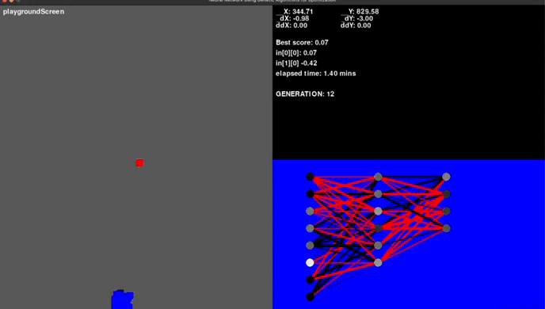

# Evolutionary Flight School

## Training a Neural Network Using Genetic Algorithms

### About

I created this small project as an experimental playground for implementing a genetic algorithm approach to train a simple neural network. The project's objective is to guide an agent to a specific point within a 2D space.

The simulation comprises two primary elements:

1. The blue square: Represents the agent, which endeavors to reach the target.
2. The red square: Signifies the target point that the agent aims to reach.

Each agent in the simulation possesses the ability to move in various directions: up, down, left, and right. They are equipped with attributes such as acceleration, velocity, and position.

Each agent is associated with a straightforward neural network, which can have any number of inputs and hidden layers but is constrained to have only four outputs, each corresponding to a specific direction.

The agent follows these steps in each iteration:

1. Feeds input data into its neural network.
2. Selects the action to take based on the maximum output from the network (e.g., output1 corresponds to moving up, output2 to moving down, output3 to moving left, and output4 to moving right).

The performance of each agent is assessed using a scoring system (or loss function), which takes into account both the distance to the target and the time elapsed since the start of the generation.

The simulation begins with an initial generation of 50 randomly generated agents. The top 5 performing agents, known as elites, are identified. New neural networks are then created by combining the values from these elite agents through crossover, supplemented with random weight assignments based on a mutation rate.

A new generation is initiated using the newly created agents, along with the introduction of some random agents to maintain variability in the population. The cycle continues: identifying the top 5 agents, generating a new population, starting a new generation, and repeating the process.

### Untrained Network

### Trained Network

Feel free to explore the project and its code for a deeper understanding of this genetic algorithm-based approach to training neural networks.